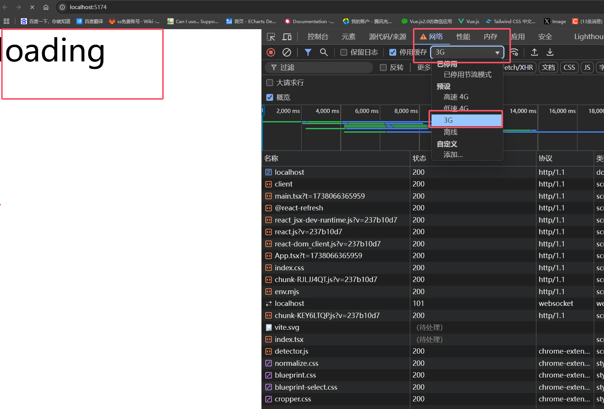
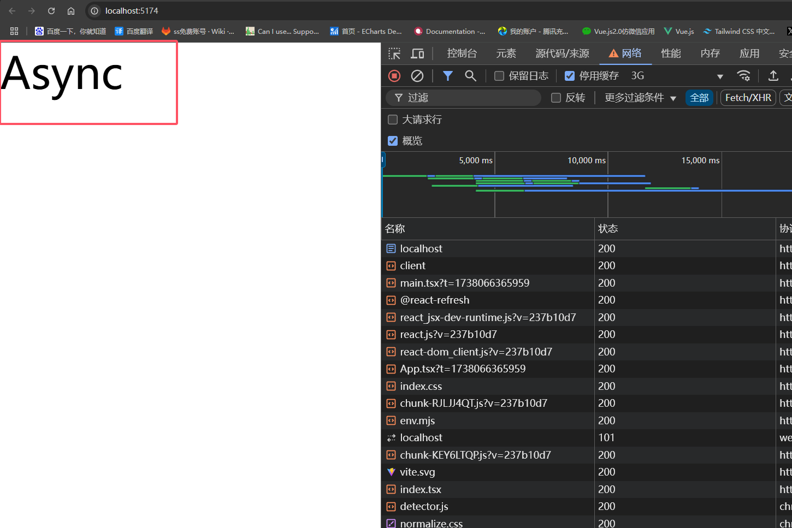

# Suspense

Suspense 是一种异步渲染机制，其核心理念是在组件加载或数据获取过程中，先展示一个占位符（loading state），从而实现更自然流畅的用户界面更新体验。

## 应用场景

- **异步组件加载**：通过代码分包实现组件的按需加载，有效减少首屏加载时的资源体积，提升应用性能。

- **异步数据加载**：在数据请求过程中展示优雅的过渡状态（如 loading 动画、骨架屏等），为用户提供更流畅的交互体验。

- **异步图片资源加载**：智能管理图片资源的加载状态，在图片完全加载前显示占位内容，确保页面布局稳定，提升用户体验。


## 用法

```tsx
<Suspense fallback={<div>Loading...</div>}>
  <AsyncComponent />
</Suspense>
```

入参:

- fallback: 指定在组件加载或数据获取过程中展示的组件或元素
- children: 指定要异步加载的组件或数据


## 案例

### 异步组件加载

创建一个异步组件

- src/components/Async/index.tsx

```tsx
export const AsyncComponent = () => {
    return <div>Async</div>
}

export default AsyncComponent
```

- src/App.tsx

使用`lazy`进行异步加载组件，使用Suspense包裹异步组件，fallback指定加载过程中的占位组件

```tsx
import React, { useRef, useState, Suspense,lazy } from 'react';
const AsyncComponent = lazy(() => import('./components/Async'))
const App: React.FC = () => {

  return (
    <>
      <Suspense fallback={<div>loading</div>}>
        <AsyncComponent />
      </Suspense>
    </>
  );
}

export default App;
```

效果如下:

:::tip
可以将网络调整到慢速，可以看到loading效果
:::






### 异步数据加载

我们实现卡片详情，在数据加载过程中展示骨架屏，数据加载完成后展示卡片详情。

:::tip
建议升级到`React19`, 因为我们会用到一个`use`的API, 这个API在`React18`中是实验性特性，在`React19`纳入正式特性
:::

模拟数据,我们放到public目录下, 方便获取直接(通过地址 + 文件名获取) 例如:

http://localhost:5173/data.json

- public/data.json

```json
{
    "data":{
        "id":1,
        "address":"北京市房山区住岗子村10086",
        "name":"噗噗",
        "age":26,
        "avatar":"https://api.dicebear.com/7.x/avataaars/svg?seed=噗噗"
    }
}   
```

创建一个骨架屏组件，用于在数据加载过程中展示，提升用户体验,当然你封装loading组件也是可以的。

- src/components/skeleton/index.tsx


```tsx
import './index.css'
export const Skeleton = () => {
    return <div className="skeleton">
        <header className="skeleton-header">
            <div className="skeleton-name"></div>
            <div className="skeleton-age"></div>
        </header>
        <section className="skeleton-content">
            <div className="skeleton-address"></div>
            <div className="skeleton-avatar"></div>
        </section>
    </div>
}
```
```css
.skeleton {
    width: 300px;
    height: 150px;
    border: 1px solid #d6d3d3;
    margin: 30px;
    border-radius: 2px;
}

.skeleton-header {
    display: flex;
    justify-content: space-between;
    align-items: center;
    border-bottom: 1px solid #d6d3d3;
    padding: 10px;
}

.skeleton-name {
    width: 100px;
    height: 20px;
    background-color: #d6d3d3;
    animation: skeleton-loading 1.5s ease-in-out infinite;
}

.skeleton-age {
    width: 50px;
    height: 20px;
    background-color: #d6d3d3;
    animation: skeleton-loading 1.5s ease-in-out infinite;
}

.skeleton-content {
    display: flex;
    justify-content: space-between;
    align-items: center;
    padding: 10px;
}

.skeleton-address {
    width: 100px;
    height: 20px;
    background-color: #d6d3d3;
    animation: skeleton-loading 1.5s ease-in-out infinite;
}

.skeleton-avatar {
    width: 50px;
    height: 50px;
    background-color: #d6d3d3;
    animation: skeleton-loading 1.5s ease-in-out infinite;
}

@keyframes skeleton-loading {
    0% {
        opacity: 0.6;
    }
    50% {
        opacity: 1;
    }
    100% {
        opacity: 0.6;
    }
}
```

创建一个卡片组件，用于展示数据，这里面介绍一个新的API `use`

`use` API 用于获取组件内部的Promise,或者Context的内容，该案例使用了use获取Promise返回的数据并且故意延迟2秒返回，模拟网络请求。

- src/components/Card/index.tsx

```tsx
import { use } from 'react'
import './index.css'
interface Data {
   name: string
   age: number
   address: string
   avatar: string
}

const getData = async () => {
   await new Promise(resolve => setTimeout(resolve, 2000))
   return await fetch('http://localhost:5173/data.json').then(res => res.json()) as { data: Data }
};

const dataPromise = getData();

const Card: React.FC = () => {
   const { data } = use(dataPromise);
   return <div className="card">
      <header className="card-header">
         <div className="card-name">{data.name}</div>
         <div className="card-age">{data.age}</div>
      </header>
      <section className="card-content">
         <div className="card-address">{data.address}</div>
         <div className="card-avatar">
            
         </div>
      </section>
   </div>;
};

export default Card;
```
```css
.card {
    width: 300px;
    height: 150px;
    border: 1px solid #d6d3d3;
    margin: 30px;
    border-radius: 2px;
}

.card-header {
    display: flex;
    justify-content: space-between;
    align-items: center;
    border-bottom: 1px solid #d6d3d3;
    padding: 10px;
}

.card-age {
    font-size: 12px;
    color: #999;
}

.card-content {
    display: flex;
    justify-content: space-between;
    align-items: center;
    padding: 10px;
}
```

使用方式如下: 通过Suspense包裹Card组件，fallback指定骨架屏组件

- src/App.tsx

```tsx
import React, { useRef, useState, Suspense,lazy } from 'react';
import Card from './components/Card'
import { Skeleton } from './components/Skeleton'
const App: React.FC = () => {

  return (
    <>
      <Suspense fallback={<Skeleton />}>
        <Card />
      </Suspense>
    </>
  );
}

export default App;
```

效果如下:


