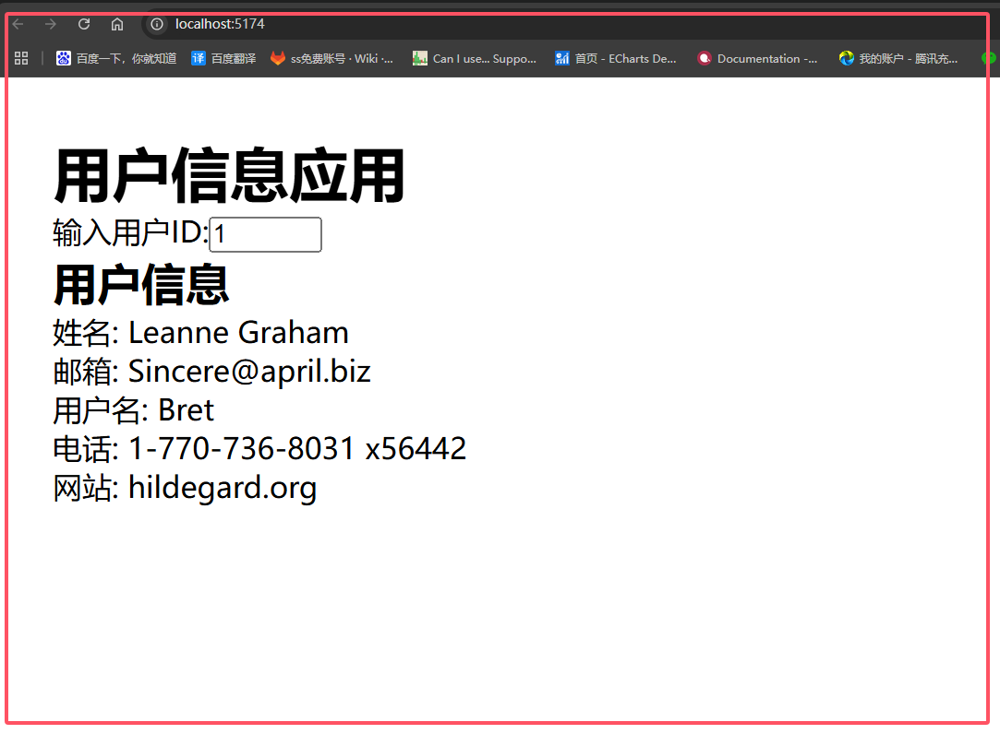

# useEffect

`useEffect` 是 React 中用于处理`副作用`的钩子。并且`useEffect` 还在这里充当生命周期函数，在之前你可能会在类组件中使用 `componentDidMount`、`componentDidUpdate` 和 `componentWillUnmount` 来处理这些生命周期事件。

## 什么是副作用函数，什么是纯函数？

**这个问题在面试中也会被经常被问到。**

### 纯函数

1. 输入决定输出：相同的输入永远会得到相同的输出。这意味着函数的行为是可预测的。
2. 无副作用：纯函数`不会修改外部状态`，也不会依赖外部可变状态。因此，纯函数内部的操作不会影响外部的变量、文件、数据库等。

#### 例子(纯函数)

```ts
const add = (x: number, y: number) => x + y
add(1,2) //3
```

### 副作用函数

1. 副作用函数 指的是那些在执行时会改变外部状态或依赖外部可变状态的函数。
2. 可预测性降低但是副作用不一定是坏事有时候副作用带来的效果才是我们所期待的
3. 高耦合度函数非常依赖外部的变量状态紧密
 - 操作引用类型
 - 操作本地存储例如`localStorage`
 - 调用外部API，例如`fetch` `ajax`
 - 操作`DOM`
 - 计时器

```ts
let globalVariable = 0;

function calculateDouble(number){  
  globalVariable += 1; //修改函数外部环境变量

  localStorage.setItem('globalVariable', globalVariable); //修改 localStorage

  fetch(/*…*/).then((res)=>{ //网络请求
   //…  
  }); 

  document.querySelector('.app').style.color = 'red'; //修改 DOM element

  return number *2
}
```

#### 例子(副作用函数)

```ts
//------------副作用函数--------------
let obj = {name:'噗噗'}
const changeObj = (obj) => {
    obj.name = '大噗噗'
    return obj
}
//噗噗
changeObj(obj) //修改了外部变量属于副作用函数
//大噗噗
//------------修改成纯函数--------------
//也就是不会改变外部传入的变量
let obj = {name:'噗噗'}
const changeObj = (obj) => {
   const newObj = window.structuredClone(obj) //深拷贝
   newObj.name = '大噗噗'
   return newObj
}
console.log(obj,'before') //obj 噗噗
let newobj = changeObj(obj)
console.log(obj,'after',newobj) //obj 噗噗 newobj 大噗噗
```

了解了副作用函数之后我们可以正式开始了解`useEffect`


## useEffect用法

```ts
useEffect(setup, dependencies?)
```
### 参数
- setup：Effect处理函数,可以返回一个清理函数。组件挂载时执行setup,依赖项更新时先执行cleanup再执行setup,组件卸载时执行cleanup。

- dependencies(可选)：setup中使用到的响应式值列表(props、state等)。必须以数组形式编写如[dep1, dep2]。不传则每次重渲染都执行Effect。

### 返回值 
useEffect 返回 `undefined`

```tsx
let a = useEffect(() => {})
console.log('a', a) //undefined
```

### 基本使用

副作用函数能做的事情`useEffect`都能做，例如操作`DOM`、网络请求、计时器等等。

#### 操作DOM

```tsx
import { useEffect } from 'react'

function App() {
  const dom = document.getElementById('data')
  console.log(dom) //null
  useEffect(() => {
    const data = document.getElementById('data')
    console.log(data) //<div id='data'>噗噗zs</div>
  }, [])
  return <div id='data'>噗噗zs</div>
}
```

#### 网络请求

```tsx
useEffect(() => {
  fetch('http://localhost:5174/?name=噗噗')
}, [])
```

### 执行时机

#### 组件挂载时执行
根据我们下面的例子可以观察到，组件在挂载的时候就执行了`useEffect`的副作用函数。

类似于`componentDidMount`

```tsx
useEffect(() => {
  console.log('组件挂载时执行')
})
```

#### 组件更新时执行

- 无依赖项更新

根据我们下面的例子可以观察到，当有响应式值发生改变时，`useEffect`的副作用函数就会执行。

类似于`componentDidUpdate` + `componentDidMount`

```tsx
import { useEffect, useState } from "react"

const App = () => {
   const [count, setCount] = useState(0)
   const [name, setName] = useState('')
   useEffect(() => {
      console.log('执行了', count, name)
   })
   return (
      <div id='data'>
         <div>
            <h3>count:{count}</h3>
            <button onClick={() => setCount(count + 1)}>+</button>
         </div>
         <div>
            <h3>name:{name}</h3>
            <input value={name} onChange={e => setName(e.target.value)} />
         </div>
      </div>
   )
}
export default App
```

- 有依赖项更新

根据我们下面的例子可以观察到，当依赖项数组中的`count`值发生改变时，`useEffect`的副作用函数就会执行。而当`name`值改变时,由于它不在依赖项数组中,所以不会触发副作用函数的执行。

```tsx
import { useEffect, useState } from "react"

const App = () => {
   const [count, setCount] = useState(0)
   const [name, setName] = useState('')
   useEffect(() => {
      console.log('执行了', count, name)
   }, [count]) //当count发生改变时执行
   return (
      <div id='data'>
         <div>
            <h3>count:{count}</h3>
            <button onClick={() => setCount(count + 1)}>+</button>
         </div>
         <div>
            <h3>name:{name}</h3>
            <input value={name} onChange={e => setName(e.target.value)} />
         </div>
      </div>
   )
}
export default App
```
- 依赖项空值

根据我们下面的例子可以观察到，当依赖项为空数组时，`useEffect`的副作用函数只会执行一次，也就是组件挂载时执行。

适合做一些`初始化`的操作例如获取详情什么的。

```tsx
import { useEffect, useState } from "react"

const App = () => {
   const [count, setCount] = useState(0)
   const [name, setName] = useState('')
   useEffect(() => {
      console.log('执行了', count, name)
   }, []) //只会执行一次
   return (
      <div id='data'>
         <div>
            <h3>count:{count}</h3>
            <button onClick={() => setCount(count + 1)}>+</button>
         </div>
         <div>
            <h3>name:{name}</h3>
            <input value={name} onChange={e => setName(e.target.value)} />
         </div>
      </div>
   )
}
export default App
```

#### 组件卸载时执行

`useEffect`的副作用函数可以返回一个清理函数，当组件卸载时，`useEffect`的副作用函数就会执行清理函数。

确切说清理函数就是副作用函数运行之前，会清楚上一次的副作用函数。

根据我们下面的例子可以观察到，当组件卸载时，`useEffect`的副作用函数就会执行。

类似于`componentWillUnmount`

```tsx
import { useEffect, useState } from "react"
// 子组件
const Child = (props: { name: string }) => {
   useEffect(() => {
      console.log('render', props.name)
      // 返回一个清理函数
      return () => {
         console.log('unmount', props.name)
      }
   }, [props.name])
   return <div>Child:{props.name}</div>
}
const App = () => {
   const [show, setShow] = useState(true)
   const [name, setName] = useState('')
   return (
      <div id='data'>
         <div>
            <h3>父组件</h3>
            <input value={name} onChange={e => setName(e.target.value)} />
            <button onClick={() => setShow(!show)}>显示/隐藏</button>
         </div>
         <hr />
         <h3>子组件</h3>
         {show && <Child name={name} />}
      </div>
   )
}

export default App
```
#### 清理函数应用场景

例如我们下面这个例子，当`name`值发生改变时，`useEffect`的副作用函数就会执行，并且会开启一个定时器，当`name`值再次发生改变时，`useEffect`的副作用函数就会执行清理函数，清除上一次的定时器。这样就避免了接口请求的重复执行。

```tsx
import { useEffect, useState } from "react"
// 子组件
const Child = (props: { name: string }) => {
   useEffect(() => {
      let timer = setTimeout(() => {
         fetch(`http://localhost:5174/?name=${props.name}`)
      }, 1000)
      return () => {
         clearTimeout(timer)
      }
   }, [props.name])
   return <div>Child</div>
}
const App = () => {
   const [show, setShow] = useState(true)
   const [name, setName] = useState('')
   return (
      <div id='data'>
         <div>
            <h3>父组件</h3>
            <input value={name} onChange={e => setName(e.target.value)} />
            <button onClick={() => setShow(!show)}>显示/隐藏</button>
         </div>
         <hr />
         <h3>子组件</h3>
         {show && <Child name={name} />}
      </div>
   )
}

export default App
```

## 真实案例

下面是一个真实的用户信息获取案例，通过`id`获取用户信息，并且当`id`发生改变时，会获取新的用户信息。

```tsx
import React, { useState, useEffect } from 'react';
interface UserData {
   name: string;
   email: string;
   username: string;
   phone: string;
   website: string;
}
function App() {
   const [userId, setUserId] = useState(1); // 假设初始用户ID为1
   const [userData, setUserData] = useState<UserData | null>(null);
   const [loading, setLoading] = useState(true);
   const [error, setError] = useState(null);

   useEffect(() => {
      const fetchUserData = async () => {
         setLoading(true);
         try {
            const response = await fetch(`https://jsonplaceholder.typicode.com/users/${userId}`); //免费api接口 可以直接使用
            if (!response.ok) {
               throw new Error('网络响应不正常');
            }
            const data = await response.json();
            setUserData(data);
         } catch (err: any) {
            setError(err.message);
         } finally {
            setLoading(false);
         }
      };
      fetchUserData();
   }, [userId]);

   const handleUserChange = (event: React.ChangeEvent<HTMLInputElement>) => {
      setUserId(parseInt(event.target.value));
   };

   return (
      <div>
         <h1>用户信息应用</h1>
         <label>
            输入用户ID:
            <input type="number" value={userId} onChange={handleUserChange} min="1" max="10" />
         </label>
         {loading && <p>加载中...</p>}
         {error && <p>错误: {error}</p>}
         {userData && (
            <div>
               <h2>用户信息</h2>
               <p>姓名: {userData.name}</p>
               <p>邮箱: {userData.email}</p>
               <p>用户名: {userData.username}</p>
               <p>电话: {userData.phone}</p>
               <p>网站: {userData.website}</p>
            </div>
         )}
      </div>
   );
}

export default App;
```

